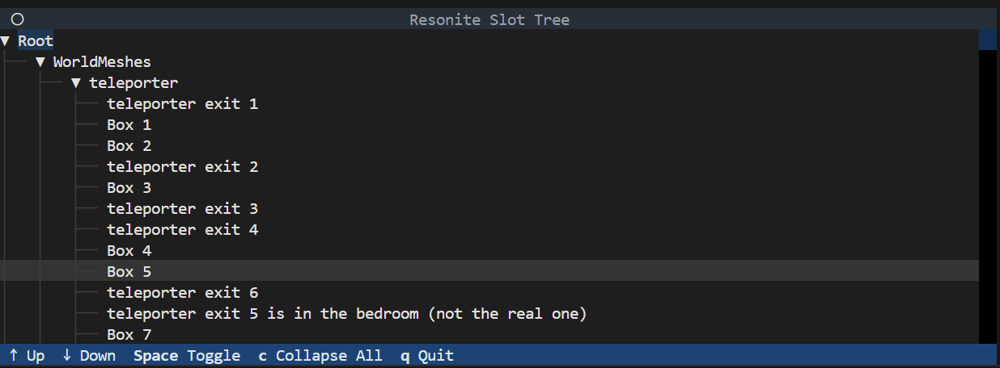

# Python bindings for [ResoniteLink](https://github.com/Yellow-Dog-Man/ResoniteLink/tree/master)

The minimum Python version for this library is 3.13.

## Release

I have released a pip package. Check the Releases section on the right. Install with `pip install <wheel-file>`.

## Remember to start ResoniteLink in your world!

You can do this in your dashboard, under Settings (Enable ResoniteLink). It will show you the port it chose. Use that for connections.

## Sample code

Take a look at examples/get_root_slot.py for a very quick and dirty method to get root slot data. You can run it as `python examples/get_root_slot.py <port>`

## Tree browser

Run `python -m pyresonitelink.cli.tree <port>`. It will download the slot hierarchy and then you can browse it.

